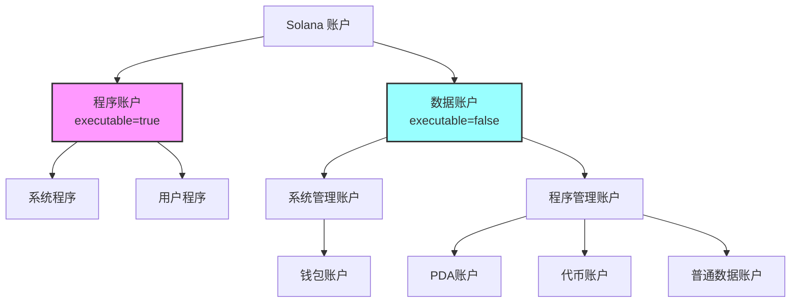

# 关于solana中的账户问题

solana上有两个需要注意⚠️的账户，这是从两种不同的视角来思考的。
第一、**客户端视角**，其实也是账户在solana上实际的存储格式，以及通过 RPC 请求获取的 `Account` 结构
第二个、**合约执行视角**，传递给智能合约的 `AccountInfo` 结构

需要深刻的理解这两种不同视角之间的区别，以便在开发过程中正确地使用它们。

## Solana上存储的账户分类

- 程序账户（Program Account）
 - System Program Account
- 数据账户（Data Account），程序账户管理数据账户。数据账户的生成可以是通过PDA生成，也可以是直接创建账户而成，一般是根据不同的指令通过pda生成程序账户需要的数据账户
  - 系统账户（System Account），系统账户是Solana网络的基础设施账户，用于管理网络的资源和状态
  - 代币账户（Token Account），代币账户其实是数据账户的一种类别，有关代币的所有元信息。
  - PDA账户，程序账户管理PDA账户。PDA账户是通过程序账户的地址和一个种子生成的，用于存储程序账户需要的数据。这个是程序执行所需要保存的状态信息

---

#### ⚠️ 关于"系统账户"的理解误区

**系统账户（System Account）** 实际上不是程序账户，而是由 **System Program（系统程序）** 管理的数据账户。让我们理清这个关系：

```
System Program (11111111111111111111111111111111) ← 这是程序账户
    ↓ 管理
System Accounts（普通钱包账户） ← 这些是数据账户
```

- **System Program**：是 Solana 的内置程序账户（executable = true）
- **System Accounts**：是由 System Program 管理的数据账户（executable = false），如钱包账户

### 优化后的账户分类体系

基于您的思路，我建议这样分类：

```yaml
Solana 账户分类
├── 按可执行性分类（基础分类）
│   ├── 程序账户（executable = true）
│   │   ├── 系统内置程序
│   │   │   ├── System Program (11111111111111111111111111111111)
│   │   │   ├── Token Program (TokenkegQfeZyiNwAJbNbGKPFXCWuBvf9Ss623VQ5DA)
│   │   │   └── BPF Loader (BPFLoader2111111111111111111111111111111111)
│   │   └── 用户部署程序
│   │       └── 自定义智能合约
│   │
│   └── 数据账户（executable = false）
│       ├── 系统账户（System-owned accounts）
│       │   └── 钱包账户（存储 SOL）
│       ├── 程序数据账户（Program-owned accounts）
│       │   ├── PDA 账户（程序派生地址）
│       │   ├── 普通数据账户（直接创建）
│       │   └── 代币账户（Token accounts）
│       │       ├── Mint 账户（代币元信息）
│       │       └── Token 账户（代币余额）
│       └── 其他特殊账户
```

### 更清晰的层次关系



### 关键概念澄清

#### 1. 所有权关系
```rust
// 程序账户（可执行）
Program Account {
    owner: BPF Loader,      // 由加载器拥有
    executable: true,       // 可执行
    data: [程序字节码]      // 存储编译后的代码
}

// 数据账户（不可执行）
Data Account {
    owner: Some Program,    // 由某个程序拥有
    executable: false,      // 不可执行
    data: [状态数据]        // 存储程序状态
}
```

#### 2. PDA账户的特殊性
您说得对，PDA账户确实是数据账户的一种，其特殊之处在于：
- **生成方式**：通过程序地址 + 种子确定性生成
- **控制权**：只能由创建它的程序控制
- **安全性**：没有对应的私钥

#### 3. 代币账户的层次
```
Token Program (程序账户)
    ├── Mint Account (数据账户 - 代币元信息)
    │   ├── supply: 总供应量
    │   ├── decimals: 小数位数
    │   └── mint_authority: 铸币权限
    │
    └── Token Account (数据账户 - 用户余额)
        ├── mint: 关联的 Mint
        ├── owner: 持有者
        └── amount: 余额
```

### 您的分类优点

1. ✅ **认识到程序管理数据账户**：这是理解 Solana 账户模型的关键
2. ✅ **强调 PDA 的重要性**：PDA 确实是 Solana 编程的核心概念
3. ✅ **理解代币账户的本质**：代币账户确实是数据账户的一种

### 改进建议

1. **区分程序本身和程序管理的账户**
   - System Program 是程序
   - System Account（钱包）是被管理的数据账户

2. **使用更准确的术语**
   - "System-owned accounts" 而非 "System accounts"
   - "Program-owned accounts" 来描述程序管理的数据账户

3. **理解所有权链**
   ```
   BPF Loader → 拥有 → 程序账户
   程序账户 → 管理 → 数据账户（包括PDA、代币账户等）
   ```

### 实用的分类思维导图

从开发者角度，可以这样理解：

```
我要开发什么？
├── 部署程序？ → 创建程序账户
└── 存储数据？ → 创建数据账户
    ├── 存储 SOL？ → System-owned 账户
    ├── 存储代币？ → Token 账户
    └── 存储程序状态？ → PDA 或普通数据账户
```

您的分类思路很好，体现了对账户关系的理解。通过这些调整，相信您能更准确地掌握 Solana 的账户模型！这种清晰的分类对于设计和开发 Solana 应用非常重要。

---

在 Solana 上，所有数据都存在于“账户”中。可以将 Solana 上的数据视为一个公共数据库，其中只有一个“账户”表，每个条目都是一个具有相同基础 账户类型的账户。

> 注意这里说的只有一个账户表是类别传统的SQL数据库来说的，在solana实际的存储上只存在一个Address<->Account的一个对应关系表。

---

在传统的 SQL 数据库中，我们有一个“账户”表，其中包含许多字段和记录，每个记录表示一个账户。通常，每个账户都有多个属性（如账户余额、用户名等），这些属性是按照表格的行和列存储的。

在 Solana 上，**没有一个传统的“账户表”**，而是通过一种类似于 **“地址 -> 账户”** 的键值对映射来管理账户。每个 Solana 账户都由一个 **公钥（地址）** 唯一标识，对应于一个 **账户数据结构（Account）**，这个数据结构存储了与该账户相关的所有信息（如余额、数据、所有者等）。因此，我们可以理解为 Solana 使用了一个 **地址到账户数据结构的映射表**，而这个“账户表”并不像传统数据库中的表格那样有固定的行和列。

### 更准确的描述：

在 Solana 中，所有账户的实际存储是通过 **`Address`（公钥）到 `Account`（账户结构）的映射关系来管理**，而 Solana 本身是一个去中心化的区块链网络，所有的账户信息通过这种映射关系存储在链上，而不是像 SQL 数据库那样有一个静态的账户表结构。

**总结**：

* 在传统数据库中，“账户表”包含行和列，代表了每个账户的不同字段和属性。
* 在 Solana 中，每个账户是通过一个 **地址（公钥） -> 账户结构（Account）** 的映射关系进行管理的，这个映射关系相当于一个映射表，而不是传统数据库中的表格。

 **Solana 账户的存储方式是通过映射表来管理的，而不是传统的表格形式**。

---

# **Solana 账户模型详解**

在 Solana 上，账户（Account）是存储数据和执行程序逻辑的基本单位。Solana 的账户模型和传统区块链（如以太坊）有很大的不同，理解这些不同点对 Solana 开发者至关重要。本文将详细介绍 Solana 上的账户模型，特别是你提到的两类账户：**通过 Solana SDK 获取的账户（Account）** 和 **传递给合约的 `AccountInfo`**，以及 Solana 的其他重要账户类型。

### **1. Solana 上的账户类型**

Solana 中的账户分为多种类型，主要包括：

* **程序账户（Program Account）**：存储智能合约程序的代码。
* **数据账户（Data Account）**：存储与合约逻辑相关的数据，常常通过 PDA 生成。
* **代币账户（Token Account）**：存储 SPL 代币的余额，用于去中心化金融应用。
* **PDA（Program Derived Address）账户**：通过程序公钥和种子（seed）生成，用于确保程序控制的数据账户。

### **2. 通过 Solana SDK 获取的账户（Account）**

#### **定义：**

通过 Solana SDK（Rust 或 TypeScript）发出的 RPC 请求会返回账户信息，这些账户信息包括账户的基本数据，如余额、所有者、数据等。使用 Solana 的 RPC 接口（例如 `getAccountInfo`）可以查询账户信息。

#### **特点：**

* **返回内容**：RPC 请求返回的账户数据包括：

  * `lamports`：账户余额。
  * `data`：账户中的原始字节数据（需要根据结构进行解析）。
  * `owner`：账户的所有者程序的公钥。
  * `executable`：布尔值，标识账户是否存储可执行程序。
  * `rent_epoch`：下一个租金支付的 epoch。

* **用途**：通过 SDK 获取的账户数据常用于客户端应用，例如查询用户余额或状态。

下面这个是实际存储在solana上定义的账户数据结构

```rust
#[derive(PartialEq, Eq, Clone, Default)]
pub struct Account {
    /// lamports in the account
    pub lamports: u64, //账户余额
    /// data held in this account
    #[cfg_attr(feature = "serde", serde(with = "serde_bytes"))]
    pub data: Vec<u8>, //账户中的原始字节数据（需要根据结构进行解析）
    /// the program that owns this account. If executable, the program that loads this account.
    pub owner: Pubkey, //账户的所有者程序的公钥
    /// this account's data contains a loaded program (and is now read-only)
    pub executable: bool, //布尔值，标识账户是否存储可执行程序。
    /// the epoch at which this account will next owe rent
    pub rent_epoch: Epoch, //下一个租金支付的 epoch。
}
```

Solana 上的账户可以存储“状态”或“可执行”程序。每个账户都有一个“地址”（公钥），作为其唯一的标识，用于定位其对应的链上数据（也就是说 查询账户的信息需要通过地址才能查询）在solana的rust sdk中就是通过RpcClient的getAccount实际就是调用的RPC的getAccountInfo 接口来查询的。

Solana 账户包含以下两种内容之一：

- 状态（也就是数据账户）：用于读取和持久化的数据。例如，关于代币的信息、用户数据或程序中定义的其他数据。如果在executable为false的情况下，账户存储状态数据。
- 可执行程序（也就是程序账户）：包含 Solana 程序实际代码的账户。这些账户存储用户可以调用的指令。根据标志executable来判断，如果为true，则账户存储可执行程序。

程序代码和程序状态的分离是 Solana 账户模型的一个关键特性。 （*******这个是不是也是solana能并行快速的原因呢？？******）

一个获取钱包账户的代码例子：

这是获取的一个钱包账户。在 Solana 上，“钱包账户”是由[系统程序](https://github.com/anza-xyz/agave/tree/v2.1.11/programs/system)（地址： 11111111111111111111111111111111）拥有的账户，系统程序是 Solana 的内置程序之一。钱包账户主要用于持有 SOL（记录在 lamports 字段中）并签署交易。


```rust
use solana_cli_config::{CONFIG_FILE, Config};
use solana_client::nonblocking::rpc_client::RpcClient;
use solana_commitment_config::CommitmentConfig;
use solana_sdk::signature::Signer;
use solana_sdk::signer::keypair::read_keypair_file;

#[tokio::main]
async fn main() -> anyhow::Result<()> {
    // read solana config file to load default rpc url and commitment config
    let config = Config::load(CONFIG_FILE.as_ref().unwrap())?;

    let client = RpcClient::new_with_commitment(
        "http://localhost:8899".to_string(),
        CommitmentConfig::confirmed(),
    );

    let key = read_keypair_file(config.keypair_path)
        .map_err(|err| anyhow::Error::msg(format!("Failed to read keypair file: {}", err)))?;

    // get AccountInfo
    let account_info = client.get_account(&key.pubkey()).await?;
    println!("{}: {:#?}", key.pubkey(), account_info);
}
```

下面是输出的内容：

```
8uAPC2UxiBjKmUksVVwUA6q4RctiXkgSAsovBR39cd1i: Account {
    lamports: 9993756299400,
    data.len: 0,
    owner: 11111111111111111111111111111111,
    executable: false,
    rent_epoch: 0,
}
```

对于钱包账户来说:

- data 字段包含以字节形式存储的账户数据,对于钱包账户，此字段为空（0 字节）。其他账户使用此字段存储程序状态或可执行程序代码。
- executable 字段指示账户的 data 字段是否包含可执行程序代码。对于钱包和存储程序状态的账户，此字段为 false。
- lamports 字段包含账户的 SOL 余额，以 lamports 为单位。Lamports 是 SOL 的最小单位。1 SOL = 1,000,000,000 lamports。
- owner 字段显示了拥有该账户的程序。对于钱包账户，所有者始终是 System Program，其地址为 11111111111111111111111111111111。
- rentEpoch 字段是一个遗留字段，源自已弃用的机制，其中账户需要支付 "rent"（以 lamports 为单位）来维护其在网络上的数据。该字段目前未使用，但为了向后兼容仍然保留。

一个获取程序账户的例子（这里使用了Token Program）：

这是一个程序账户,Token Program 是 Solana 上的一个可执行程序账户。与钱包账户类似，程序账户具有相同的基础 账户 数据结构，但其字段存在关键差异。

```rust
use solana_cli_config::{CONFIG_FILE, Config};
use solana_client::nonblocking::rpc_client::RpcClient;
use solana_commitment_config::CommitmentConfig;
use solana_sdk::pubkey::Pubkey;
use std::str::FromStr;
use solana_sdk::signer::keypair::read_keypair_file;

#[tokio::main]
async fn main() -> anyhow::Result<()> {
    // read solana config file to load default rpc url and commitment config
    let config = Config::load(CONFIG_FILE.as_ref().unwrap())?;

    let client = RpcClient::new_with_commitment(
        "http://localhost:8899".to_string(),
        CommitmentConfig::confirmed(),
    );

    let key = read_keypair_file(config.keypair_path)
        .map_err(|err| anyhow::Error::msg(format!("Failed to read keypair file: {}", err)))?;

    // TokenkegQfeZyiNwAJbNbGKPFXCWuBvf9Ss623VQ5DA
    let token_account = client
       .get_account(&Pubkey::from_str(
           "TokenkegQfeZyiNwAJbNbGKPFXCWuBvf9Ss623VQ5DA",
       )?)
       .await?;
   println!(
       "TokenkegQfeZyiNwAJbNbGKPFXCWuBvf9Ss623VQ5DA: {:#?}",
       token_account
   );
}
```

下面是输出:
```
TokenkegQfeZyiNwAJbNbGKPFXCWuBvf9Ss623VQ5DA: Account {
    lamports: 934087680,
    data.len: 134080,
    owner: BPFLoader2111111111111111111111111111111111,
    executable: true,
    rent_epoch: 0,
    data: 7f454c460201010000000000000000000300f70001000000d8f90000000000004000000000000000800902000000000000000000400038000400400009000800,
}
```

-  executable 字段被设置为 true，表明此账户的 data 字段包含可执行的程序代码。
- 对于程序账户，data 字段存储程序的可执行代码。相比之下，钱包账户的数据字段是空的。 当您部署一个 Solana 程序时，该程序的可执行代码存储在账户的 data 字段中。
- 可执行程序账户还会指定一个程序作为账户的 owner。所有程序账户都由一个加载器程序（Loader program）拥有，这是一类内置程序，负责拥有 Solana 上的可执行程序账户。 对于 Token Program，owner 是 BPFLoader2 程序。


一个存储了状态的账户的例子: 这里使用的是存储了USDC meta信息的账户，也就是mint账户 EPjFWdd5AufqSSqeM2qN1xzybapC8G4wEGGkZwyTDt1v (USDC)

```rust
use solana_cli_config::{CONFIG_FILE, Config};
use solana_client::nonblocking::rpc_client::RpcClient;
use solana_commitment_config::CommitmentConfig;
use solana_sdk::pubkey::Pubkey;
use std::str::FromStr;
use solana_sdk::signer::keypair::read_keypair_file;

#[tokio::main]
async fn main() -> anyhow::Result<()> {
    // read solana config file to load default rpc url and commitment config
    let config = Config::load(CONFIG_FILE.as_ref().unwrap())?;

    let client = RpcClient::new_with_commitment(
        "http://localhost:8899".to_string(),
        CommitmentConfig::confirmed(),
    );

    let key = read_keypair_file(config.keypair_path)
        .map_err(|err| anyhow::Error::msg(format!("Failed to read keypair file: {}", err)))?;

    // EPjFWdd5AufqSSqeM2qN1xzybapC8G4wEGGkZwyTDt1v (USDC)
    let usdc_account = client
        .get_account(&Pubkey::from_str(
            "EPjFWdd5AufqSSqeM2qN1xzybapC8G4wEGGkZwyTDt1v",
        )?)
        .await?;
    println!(
        "EPjFWdd5AufqSSqeM2qN1xzybapC8G4wEGGkZwyTDt1v (USDC): {:#?}",
        usdc_account
    );
}
```

下面是输出：

```
EPjFWdd5AufqSSqeM2qN1xzybapC8G4wEGGkZwyTDt1v (USDC): Account {
    lamports: 418404941779,
    data.len: 82,
    owner: TokenkegQfeZyiNwAJbNbGKPFXCWuBvf9Ss623VQ5DA,
    executable: false,
    rent_epoch: 18446744073709551615,
    data: 0100000098fe86e88d9be2ea8bc1cca4878b2988c240f52b8424bfb40ed1a2ddcb5e199b84aa8e711c1724000601010000006270aa8a59c59405b45286c86772,
}
```

-  在此示例中需要注意的关键点是，Mint 账户存储的是状态，而不是可执行代码。Mint 账户由 Token Program 拥有，该程序包含定义如何创建和更新 Mint 账户的指令。
- executable 字段是 false，因为 Mint 账户的 data 字段存储的是状态，而不是可执行代码。Token Program 定义了 Mint 数据类型，该类型存储在 Mint 账户的 data 字段中。
- data 字段包含序列化的 Mint 账户状态，例如 Mint 权限、总供应量、小数位数。要从 Mint 账户中读取数据，必须将 data 字段反序列化为 Mint 数据类型。
- Token Program (TokenkegQfeZyiNwAJbNbGKPFXCWuBvf9Ss623VQ5DA) 拥有 Mint 账户。这意味着 Mint 账户的 data 字段只能通过 Token Program 定义的指令进行修改。

#### **注意事项：**

* 返回的 `data` 字段是账户的原始字节流数据，通常需要进一步解析才能获取实际的内容。
* 这些账户是在 Solana 网络上实际存储的账户。

### **3. 传递给合约的 `AccountInfo`**

#### **定义：**

在 Solana 合约（智能合约）中，账户信息是通过 `AccountInfo` 结构传递给合约的。`AccountInfo` 是 Solana 提供的一种数据结构，用于在执行合约时传递账户的元数据和状态信息。

#### **特点：**

* **包含的信息**：

  * `key`：账户的公钥。
  * `isSigner`：布尔值，指示账户是否是签名者。
  * `isWritable`：布尔值，指示账户是否可写。
  * `lamports`：账户的余额。
  * `data`：账户存储的数据（类似于 SDK 返回的账户数据）。
  * `owner`：账户的所有者程序的公钥。
  * `executable`：布尔值，指示账户是否为可执行程序。
  * `rent_epoch`：账户的下一个租金支付 epoch。

#### **用途：**

* `AccountInfo` 是合约中的参数，合约通过 `AccountInfo` 来访问和修改账户的状态数据。
* 它是智能合约执行时的核心数据结构，传递给合约的账户可以通过该结构来修改账户中的数据（如更新余额、合约状态等）。

#### **区别于 SDK 获取的账户（Account）：**

* **`AccountInfo` 传递的是更高层的抽象**：在合约中，`AccountInfo` 是传递给合约的接口，它包括账户的所有元数据，并提供一些可操作的字段，如 `isWritable` 和 `isSigner`。而通过 RPC 获取的账户（`Account`）更侧重于查询账户信息的静态数据。
* **作用范围不同**：RPC 获取的账户更多用于客户端查询，而 `AccountInfo` 是在合约执行时传递的实际数据结构，用于操作账户数据。

---

### **4. Solana 账户之间的关系与工作流程**

在 Solana 中，账户主要用于存储数据和执行程序，而程序通过 `AccountInfo` 来与账户进行交互。以下是两种账户的具体使用场景：

#### **在客户端使用 RPC 获取账户（Account）**

1. 客户端通过 Solana SDK 发出 RPC 请求，查询账户信息。
2. 返回的账户数据可以用于查询余额、检查状态等。
3. 这种账户信息通常是静态的，供外部应用程序（如钱包）使用。

#### **在合约中使用 `AccountInfo`**

1. 合约在执行时会接收 `AccountInfo`，这个结构包含了账户的详细信息。
2. 合约通过 `AccountInfo` 来读取和修改账户的数据（例如余额或合约状态）。
3. `AccountInfo` 传递的是账户信息的动态视图，合约根据权限（如 `isWritable`）来决定是否修改账户的 `data` 字段。

---

### **5. 账户类型总结**

| 账户类型       | 定义               | 用途                   | 特点                                |
| ---------- | ---------------- | -------------------- | --------------------------------- |
| **程序账户**   | 存储合约的程序代码        | 执行智能合约逻辑             | `executable` 字段为 `true`，所有者为程序的公钥 |
| **数据账户**   | 存储合约相关的状态数据      | 存储合约操作所需的数据          | 存储的 `data` 字段包含合约需要的数据            |
| **代币账户**   | 存储 SPL 代币的余额     | 存储和管理代币的数量、所有者等元信息   | 由 SPL Token Program 管理，存储代币余额     |
| **PDA 账户** | 通过程序公钥和种子生成的唯一账户 | 存储与程序相关的数据或状态，防止外部控制 | 不依赖私钥，地址由程序公钥和种子生成，不能被外部控制        |

---

### **6. 总结与补充**

* **两种账户的区别**：

  * **通过 Solana SDK 获取的账户（Account）** 是通过 RPC 请求返回的，包含账户的余额、数据和所有者等信息，主要用于外部客户端查询。
  * **传递给合约的 `AccountInfo`** 是在合约执行时由 Solana 网络提供的账户信息，包含账户的元数据和状态，供合约在运行时使用。

* **Solana 的账户管理模型**：

  * 程序账户存储可执行的程序代码。
  * 数据账户存储程序的状态数据，通常通过 PDA 生成。
  * 代币账户用于管理 SPL 代币的余额。
  * 通过 `AccountInfo`，合约可以在执行时访问和操作这些账户的状态。

* **PDA 账户** 是 Solana 中非常重要的概念，常用于存储合约的状态或防止外部控制。

---

# **Solana 账户模型与区分两种账户使用方式**

在 Solana 中，所有数据都存储在“账户”中。每个账户由一个公钥（地址）唯一标识，并与一个存储该账户相关数据的结构（`Account`）关联。虽然 Solana 上所有账户共享相同的数据结构，但从 **Solana 网络存储视角** 和 **合约执行视角** 来看，这些账户的用途和传递方式有所不同。

## **1. 账户存储视角：Solana 网络的账户**

在 Solana 网络上，账户存储以 **“地址 -> 账户”** 键值对映射的方式进行管理。每个账户由一个 **公钥（地址）** 唯一标识，对应一个 **`Account` 结构**。这个结构包含了账户的基本信息，如余额、数据、所有者等。

### **存储结构：Solana 上的账户数据结构（Account）**

```rust
#[derive(PartialEq, Eq, Clone, Default)]
pub struct Account {
    pub lamports: u64, // 账户余额
    pub data: Vec<u8>, // 账户中的数据（通常是原始字节数据）
    pub owner: Pubkey, // 账户的所有者程序公钥
    pub executable: bool, // 是否为可执行程序
    pub rent_epoch: Epoch, // 下一个租金支付的 epoch
}
```

* **lamports**：账户余额（以 lamports 为单位，1 SOL = 10⁹ lamports）。
* **data**：存储的原始字节数据，可能是程序状态、用户数据或其他类型的存储。
* **owner**：账户的所有者程序的公钥。
* **executable**：布尔值，指示账户是否存储可执行程序代码。
* **rent_epoch**：账户下次需要支付租金的 epoch。

### **Solana 的账户存储方式：**

Solana 上所有的账户都存储在这种 **“地址 -> 账户数据结构”** 映射关系中。此账户数据结构用于存储每个账户的基础信息，无论账户是用于存储程序状态、代币余额，还是智能合约执行。

### **总结**：

从存储视角来看，Solana 上的账户是通过一个 **公钥（地址） -> 账户结构（Account）** 的映射关系进行管理的，Solana 本身是去中心化的区块链网络，这种映射关系是链上数据的一部分，和传统的数据库中的“账户表”不同。

---

## **2. 合约执行视角：通过 `AccountInfo` 传递账户信息**

在智能合约中，Solana 会通过 **`AccountInfo`** 结构传递账户信息。`AccountInfo` 作为合约执行时的参数，提供了账户的元数据和状态。合约通过 `AccountInfo` 来操作和更新账户的状态。

### **`AccountInfo` 的结构**

```rust
pub struct AccountInfo {
    pub key: Pubkey,           // 账户公钥
    pub is_signer: bool,       // 是否是签名者
    pub is_writable: bool,     // 是否可以写
    pub lamports: u64,         // 账户余额
    pub data: RefCell<Vec<u8>>, // 存储账户数据
    pub owner: Pubkey,         // 账户的所有者程序公钥
    pub executable: bool,      // 是否为可执行程序
    pub rent_epoch: Epoch,     // 下一个租金支付的 epoch
}
```

#### **`AccountInfo` 的关键字段：**

* **key**：账户的公钥。
* **is_signer**：布尔值，表示账户是否为签名者（必须签署交易才能执行合约操作）。
* **is_writable**：布尔值，指示账户是否可写（合约是否可以修改账户数据）。
* **data**：存储账户实际数据（即 `data` 字段在链上存储的内容）。
* **owner**：账户的所有者程序的公钥，指示账户的控制者。
* **executable**：指示该账户是否为可执行程序。
* **lamports**：账户余额（与存储方式相同，但在合约执行时可操作）。
* **rent_epoch**：账户的租金支付时间。

### **如何使用 `AccountInfo`：**

* `AccountInfo` 传递的是更高层次的抽象，它封装了账户的元数据，并且在合约执行时提供了对账户状态的直接访问。
* 合约通过 `AccountInfo` 获取账户的元数据，如是否可写、是否签名、账户余额等。
* 合约可以修改账户数据（如更新余额、状态）或读取这些信息。

### **总结：**

`AccountInfo` 是 Solana 合约执行过程中用于传递账户的关键数据结构，它封装了账户的元数据和状态，并提供了对账户操作的权限控制。

---

## **3. 两种账户的对比：**

* **通过 Solana SDK 获取的账户（Account）**：

  * 是从 Solana 网络上通过 RPC 请求返回的账户数据。
  * 主要用于客户端查询，如查询余额或账户状态。
  * 包含账户的基本信息，如余额、所有者、数据等。
  * 账户信息是静态的，用于外部应用（例如钱包）交互。

* **传递给合约的 `AccountInfo`**：

  * 是合约执行时传递给合约的账户信息。
  * 允许合约访问和操作账户的状态数据。
  * 包含账户的元数据，如是否可写、是否签名、账户余额等。
  * 账户信息是动态的，用于程序的运行时操作。

### **总结：**

* 从 **存储视角** 看，通过 RPC 获取的账户（`Account`）数据包含了账户的原始信息。
* 从 **合约执行视角** 看，`AccountInfo` 提供了一个更加抽象和操作化的视图，允许程序执行时对账户进行修改和控制。

---

## **4. Solana 账户模型中的其他账户类型**

### **程序账户（Program Account）**

* 存储可执行的合约代码。
* 由程序的公钥作为所有者，`executable` 字段为 `true`。

### **数据账户（Data Account）**

* 存储合约状态数据。
* 通过 `PDA` 生成，通常由程序控制，用于存储和管理程序的状态。

### **代币账户（Token Account）**

* 存储 SPL 代币的余额。
* 管理代币相关的元数据，如代币的总供应量、持有者、余额等。

### **PDA（Program Derived Address）**

* 通过程序的公钥和种子生成的唯一地址。
* 用于存储程序的状态数据，防止外部控制。

---

## **总结：**

Solana 的账户模型通过将账户分为不同类型（程序账户、数据账户、代币账户等），为开发者提供了灵活的数据存储和管理机制。理解 `Account` 和 `AccountInfo` 之间的区别，以及如何在合约中使用它们，是开发 Solana 应用的基础。


---

# **Solana 账户模型及其在不同上下文中的应用**

在 Solana 中，所有的数据和智能合约逻辑都通过账户（Account）进行存储和管理。理解 **账户类型**、**如何查询账户信息** 以及 **如何在智能合约中使用账户** 对于 Solana 开发者至关重要。Solana 的账户模型与传统区块链（如以太坊）有显著的不同，特别是 Solana 在处理账户数据时的高效性和灵活性。

## **1. Solana 账户的存储方式：公钥到账户数据结构的映射**

在 Solana 上，账户存储采用 **“地址 -> 账户数据结构（Account）”** 的键值对映射方式，而不是传统数据库中的“账户表”形式。每个账户都由一个 **公钥（地址）** 唯一标识，并对应于一个存储该账户相关信息的 **账户数据结构（Account）**。

### **Solana 账户数据结构（Account）**

```rust
#[derive(PartialEq, Eq, Clone, Default)]
pub struct Account {
    pub lamports: u64, // 账户余额
    pub data: Vec<u8>, // 账户中的数据
    pub owner: Pubkey, // 账户的所有者程序的公钥
    pub executable: bool, // 是否为可执行程序
    pub rent_epoch: Epoch, // 下一个租金支付的 epoch
}
```

* **lamports**：账户余额（以 lamports 为单位，1 SOL = 10⁹ lamports）。
* **data**：账户存储的数据，通常是字节数组，存储程序状态、用户数据或合约执行逻辑。
* **owner**：账户的所有者程序的公钥。
* **executable**：布尔值，指示账户是否存储可执行程序代码。
* **rent_epoch**：账户下次需要支付租金的 epoch。

### **映射关系：**

* **地址 -> 账户结构**：Solana 使用一个 **“公钥（地址） -> 账户数据结构”** 的映射关系来管理账户数据，而不是传统的“账户表”。
* **存储和访问**：Solana 通过这一映射关系存储和访问账户数据。每个账户的唯一标识符是其公钥，存储的内容包括余额、所有者程序等信息。

### **总结：**

在 Solana 中，账户存储的方式是一种映射表，称为 **“公钥（地址） -> 账户结构”**，而不是像 SQL 数据库那样使用表格行列形式存储。

---

## **2. Solana 账户模型中的关键账户类型**

Solana 上的账户分为多种类型，每种类型都用于存储不同的数据或程序逻辑。理解这些账户类型对于开发 Solana 应用至关重要。

### **账户类型：**

* **程序账户（Program Account）**：

  * **定义**：存储智能合约程序的代码。
  * **特点**：`executable` 字段为 `true`，程序账户由特定程序的公钥作为所有者。
  * **用途**：存储可执行的合约代码，供客户端调用和执行。

* **数据账户（Data Account）**：

  * **定义**：存储与合约逻辑相关的数据。
  * **特点**：通常由程序控制，通过 **PDA（程序派生地址）** 生成。
  * **用途**：存储合约的状态数据，如用户余额、交易历史等。

* **代币账户（Token Account）**：

  * **定义**：存储 **SPL 代币** 的余额和元信息。
  * **特点**：由 **SPL Token Program** 管理，存储代币数量、所有者等信息。
  * **用途**：用于去中心化金融（DeFi）应用，管理和转移 SPL 代币。

* **PDA 账户（Program Derived Address）**：

  * **定义**：通过程序公钥和种子生成的唯一地址。
  * **特点**：没有对应的私钥，无法直接由用户控制。
  * **用途**：存储程序的状态数据，防止外部滥用。

---

## **3. `Account` 与 `AccountInfo` 的区别**

在 Solana 中，账户信息主要通过 **RPC 查询（`Account`）** 和 **合约执行（`AccountInfo`）** 两种方式进行交互。理解这两者的区别对于在 Solana 上开发高效的应用非常重要。

### **通过 Solana SDK 获取的账户（`Account`）**

* **定义**：通过 Solana SDK（Rust 或 TypeScript）发出的 RPC 请求获取的账户数据。
* **主要用途**：用于客户端应用，例如查询账户余额、状态等。
* **特点**：

  * **静态数据**：返回的是账户的基本信息，如余额、所有者、数据等。
  * **查询方式**：通过 RPC 接口（如 `getAccountInfo`）查询账户信息。

### **传递给合约的 `AccountInfo`**

* **定义**：在 Solana 合约中，账户信息是通过 `AccountInfo` 结构传递给合约的。
* **主要用途**：合约在执行过程中使用 `AccountInfo` 来访问和修改账户数据。
* **特点**：

  * **动态视图**：包含账户的元数据和当前状态，可以用来执行操作。
  * **包括更多元数据**：如是否可写（`isWritable`）、是否签名（`isSigner`）、账户余额等。

### **对比：**

* **`Account`（RPC 查询）**：主要用于获取账户的静态信息，通常用于外部客户端的查询（如钱包）。
* **`AccountInfo`（合约执行）**：传递给智能合约的账户信息，供合约在执行时动态访问和修改账户数据。

### **总结**：

* `Account` 用于从网络查询账户信息，静态且只读。
* `AccountInfo` 用于合约执行时访问账户信息，提供动态权限控制和可写权限。

---

## **4. 账户数据存储与程序代码的分离**

Solana 的账户模型有一个显著特征：**程序代码与程序状态的分离**。这种分离使得 Solana 能够在并行执行和高吞吐量上表现出色。

* **程序账户**：存储智能合约的代码，并由程序的公钥作为所有者。
* **数据账户**：存储程序的状态数据，而不是程序代码。
* **好处**：通过将程序代码与程序状态分离，Solana 能够支持多个程序并行执行，提升了性能。

---

## **5. 总结：Solana 账户模型的核心概念**

* **Solana 账户存储**：通过 **“地址 -> 账户数据结构”** 的映射关系来管理账户。
* **账户类型**：

  * **程序账户**：存储可执行程序。
  * **数据账户**：存储程序状态。
  * **代币账户**：存储 SPL 代币余额。
  * **PDA 账户**：通过程序公钥和种子生成的唯一地址。
* **`Account` 与 `AccountInfo` 的区别**：

  * **`Account`**：通过 RPC 获取的账户信息，用于查询。
  * **`AccountInfo`**：合约执行时传递的账户信息，用于访问和修改。

---

### **最终思路整合：**

Solana 的账户模型提供了一种高效且灵活的方式来存储和管理程序数据、代币信息及状态数据。通过区分 **`Account`** 和 **`AccountInfo`**，Solana 在查询和合约执行中提供了不同的视角与功能，确保了系统的高效运行与灵活性。理解这两者之间的区别以及其他账户类型的使用，将帮助您在开发 Solana 应用时更加得心应手。
